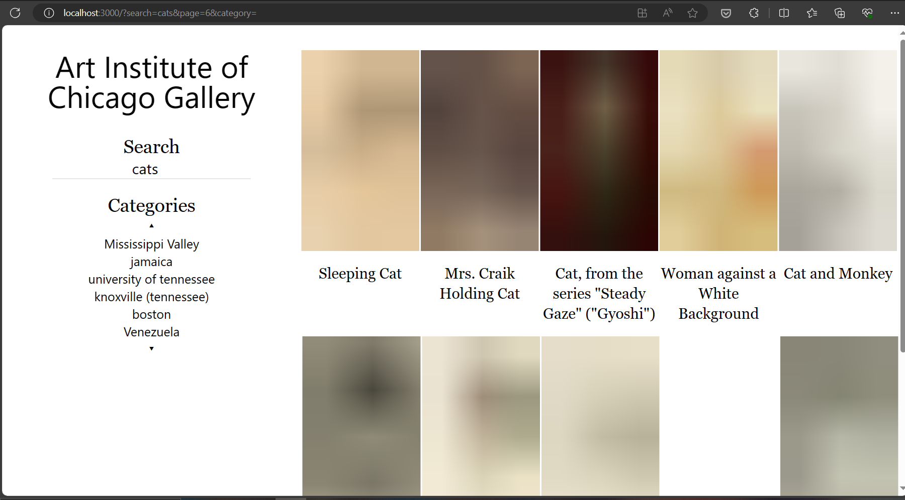
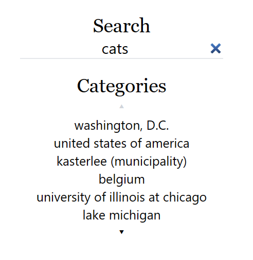
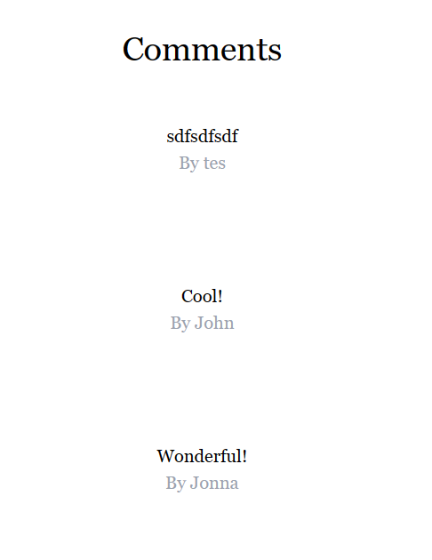
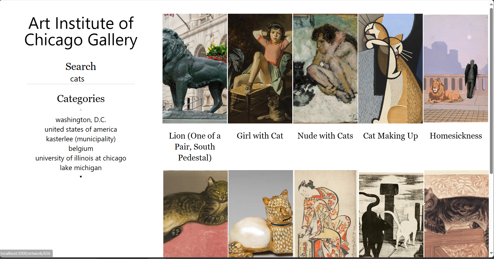
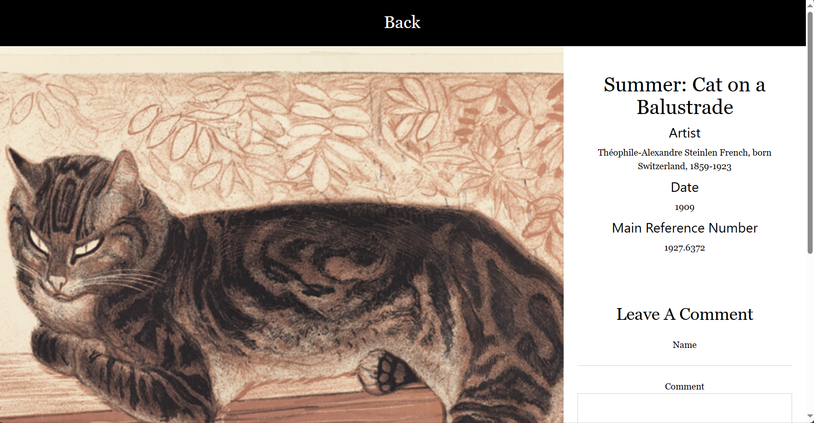
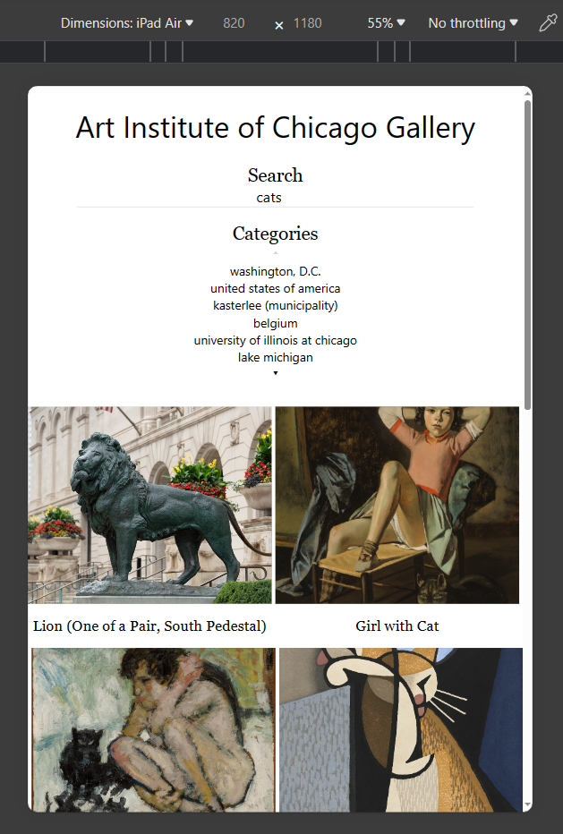
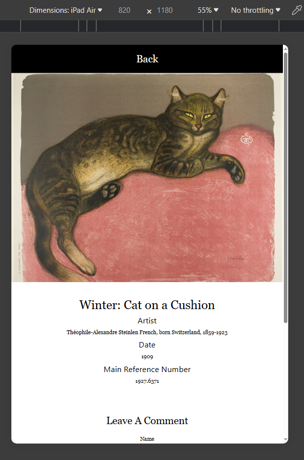
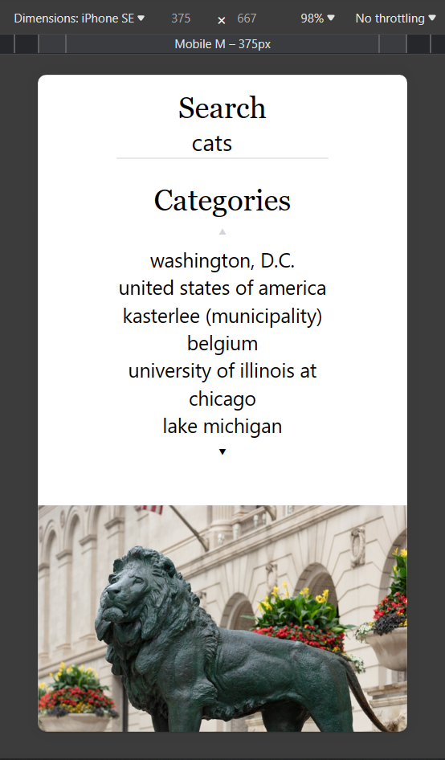
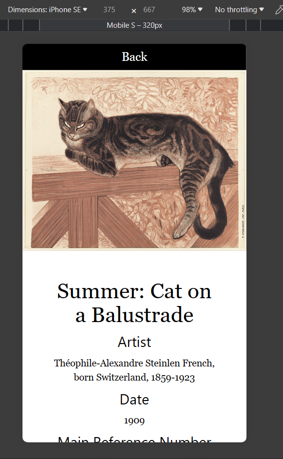

# Tech Stack
- Project Setup: Utilize Create-react-app with Typescript for single page react application and efficient development.
- Styling: Implement Tailwind CSS for rapid and scalable styling.
    - Utilize Prettier for sorting classes to maintain consistency.
- Routing: Implement React-router-dom for seamless navigation and manipulation of queries and pathname.
- State management: React hooks( useState) and URL search queries/ pathname
- Code Quality: Utilize ESLint for ensuring code formatting consistency.

# Data Fetching
- Implement data fetching upon entering the home page and artwork detail page to ensure up-to-date information
- With URLs with queries user can view artworks accordingly. For example, with `/?search=cats&page=1&category=TM-13183`, users can query 10 artworks with keyword `cats`, category as `TM-13183` on the first page
- There are 4 states in artwork list
    - display list
    - empty list
    - error on loading list
    - loading the list

# Image Handling
- Utilize CSS padding-top for image placeholders to prevent CLS on loading images.
- Implement thumbnail image for blurry image loading.
- Display images using IIIF Image API for optimized performance.

# Search Params
Users are able to search the artwork by title and the ability to filter the results by category

## Keyword Search
- Implement debouncing for efficient keyword search functionality.
- Utilize `createSearchParams` in `react-router-dom` for encoding queries to ensure secure and structured search operations.

## Category Filtering
- Load categories dynamically using the category-item API.
- Set the search parameter upon selecting a category to streamline filtering.

## Pagination

- Display 9 pages and provide intuitive buttons for navigating forward and backward by 10 pages for enhanced user experience.

# Artwork detail page
- `title`, `artist_display`, `date_display`, `main_reference_number`, `thumbnail`, `dimensions_detail` fields are displayed on the page if available 

## Comment Section

- Users can leave comments for an artwork. The comments are saved in component state and not persistent after navigation
- There are 2 states in comment list
    - display list
    - empty list

- Implement data validation to ensure accuracy upon updating inputs and submitting comments.
Clear the form upon successful submission to enhance user interaction.

# Responsive Web Design (RWD)
Optimize design and layout for desktop, tablet, and mobile devices to ensure a consistent and user-friendly experience across various screen sizes.
- Desktop

- Tablet

- Mobile

